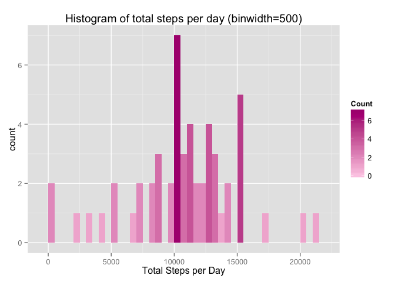

# Reproducible Research - Self Monitor Activity Dataset Analysis
My D. Coyne  
March 9, 2015  

    
---

### Introduction

It is now possible to collect a large amount of data about personal movement using activity monitoring devices such as a Fitbit, Nike Fuelband, or Jawbone Up. In this assignment one will analyze a self monintor dataset;  the data is collected by an anonymous individual collected during the months of October and November, 2012 and include the number of steps taken in 5 minute intervals each day.  **The objective of the assignment is to show how tool such as knitr and R-mardow would help analysts in creating reproducible data analysis research project.**

### About the Dataset

The variables included in this dataset are:

1. steps:  Number of steps taking in a 5-minute interval (missing values are coded as NA)

2. date: The date on which the measurement was taken in YYYY-MM-DD format

3. interval:  Identifier for the 5-minute interval at which the measurements were taken.  *Each interval of the day is identified by a number; i.e. the identifier is same for 8:00 - 8:05 am every day of the year.*  

The dataset is stored in a comma-separated-value (CSV) file and there are a total of 17,568 observations in this dataset.

## I.   Loading and preprocessing the data

The activity data set is read in memory using read.table(), with comma is a separator and convert to a data frame.  Some prelimiary observations on the dataset:

1.  There are total of 17,568 observation; after removing the obseravations that contain NAs, there are 15,264 observations remained.

2.  The observations spanned through 61 days; of which only 53 days that contains non-NAs observations.  


```r
dat <-  data.frame(read.table
                   ("~/Documents/Coursera/ReproR/GitTest/RepData_PeerAssessment1/activity.csv"
                    , header=TRUE, sep=","))

## Removing NA's
df <- na.omit(dat);
nrow(df)
```

```
## [1] 15264
```

```r
## Number of days spanned with NA's
tDays <- unique(dat$date)
length(tDays)
```

```
## [1] 61
```

```r
## Number of days spanned without NA's
t <- unique(df$date)
length(t)
```

```
## [1] 53
```


## II.  What is mean total number of steps taken per day?

In this section, the observations with missing values are ignored, or not included in the analysis.  

1.  Calculate the total number of steps taken per day.  The rows in the dataset can be grouped into each day, then one can sum up the steps of the observed intervals of the day.  To do this, one can use aggregate() function -- aggreage data base on date, and apply summaation on the steps, as in the below line of code: 


```r
totalStepsPerDay <-aggregate(x=df$steps,list(date=df$date), FUN=sum, na.rm=TRUE);
totalStepsPerDay
```

```
##          date     x
## 1  2012-10-02   126
## 2  2012-10-03 11352
## 3  2012-10-04 12116
## 4  2012-10-05 13294
## 5  2012-10-06 15420
## 6  2012-10-07 11015
## 7  2012-10-09 12811
## 8  2012-10-10  9900
## 9  2012-10-11 10304
## 10 2012-10-12 17382
## 11 2012-10-13 12426
## 12 2012-10-14 15098
## 13 2012-10-15 10139
## 14 2012-10-16 15084
## 15 2012-10-17 13452
## 16 2012-10-18 10056
## 17 2012-10-19 11829
## 18 2012-10-20 10395
## 19 2012-10-21  8821
## 20 2012-10-22 13460
## 21 2012-10-23  8918
## 22 2012-10-24  8355
## 23 2012-10-25  2492
## 24 2012-10-26  6778
## 25 2012-10-27 10119
## 26 2012-10-28 11458
## 27 2012-10-29  5018
## 28 2012-10-30  9819
## 29 2012-10-31 15414
## 30 2012-11-02 10600
## 31 2012-11-03 10571
## 32 2012-11-05 10439
## 33 2012-11-06  8334
## 34 2012-11-07 12883
## 35 2012-11-08  3219
## 36 2012-11-11 12608
## 37 2012-11-12 10765
## 38 2012-11-13  7336
## 39 2012-11-15    41
## 40 2012-11-16  5441
## 41 2012-11-17 14339
## 42 2012-11-18 15110
## 43 2012-11-19  8841
## 44 2012-11-20  4472
## 45 2012-11-21 12787
## 46 2012-11-22 20427
## 47 2012-11-23 21194
## 48 2012-11-24 14478
## 49 2012-11-25 11834
## 50 2012-11-26 11162
## 51 2012-11-27 13646
## 52 2012-11-28 10183
## 53 2012-11-29  7047
```

2.  Histogram to show totals steps taken each day


```r
library (ggplot2)

h <-ggplot(data=totalStepsPerDay, aes(x=x))+
          ggtitle("Histogram of total steps per day (binwidth=500)") + 
          xlab("Total Steps per Day")
h + geom_histogram(binwidth=500, aes(fill = ..count..)) +
    scale_fill_gradient("Count", low="#fccde5", high="#ae017e")
```

 

3.  Calculate and report the mean and median of the total steps taken per day


```r
mu <- mean (totalStepsPerDay$x)
mu
```

```
## [1] 10766.19
```

```r
med <- median (totalStepsPerDay$x)
med
```

```
## [1] 10765
```

## III.  What is the average daily activity pattern?

1.  **Ploting the average steps taken per interval identifier, across all observed days**

The interval identifier is a label for a five-minute interval during the date.   The dataset will be grouped using the interval identifers for all observed days; then the averaage steps is calculated for each groups.   The code is below. 


```r
aveStepsPerInterval <-aggregate(x=df$steps,list(Interval=df$interval), FUN=mean, na.rm=TRUE);
```

Below code will plot the average of steps per interval identifier, across the observer days. 


```r
library(scales)
x_breaks <- c(0,55,100,155,200,255,300,355,400, 455, 500, 555,
            600, 655, 700, 755, 800, 855, 900, 955, 1000, 1055, 
           1100, 1155, 1200, 1255, 1300, 1355, 1400, 1455, 1500, 1555, 
           1600, 1655, 1700, 1755, 1800, 1855, 1900, 1955, 2000, 2055,
           2100,2155,2200,2255,2300,2355)
 
avePlot <- ggplot(data=aveStepsPerInterval, aes(x = Interval, y = x, group=1)) +
  ggtitle("Average steps taken per interval, across all observed days") + 
  xlab("Interval ID") +
  ylab("Average Steps Per Interval") +
  scale_x_discrete( breaks=x_breaks) +
  theme(axis.text.x = element_text(angle = 90, hjust = 1))

avePlot <- avePlot + 
           geom_point(aes(colour = x)) +
           geom_line(color="#41b6c4")
avePlot
```

 

2.  **Calulating the maxinum average steps and identify the interval where the max is found**

The maxinum average steps is round up to be **206 steps**, and it occurs at the time with interval identifier of **835 time interval**.  


```r
mx <- round(max(aveStepsPerInterval$x));
mx
```

```
## [1] 206
```

```r
indx <- which(aveStepsPerInterval$x==max(aveStepsPerInterval$x));
mxInterval <- aveStepsPerInterval$Interval[indx]
mxInterval
```

```
## [1] 835
```

## IV.  Imputing missing values

1. **Total number of missing values in the dataset**

The dataset **dat** read from *activity.csv* contains the NAs.  The total number of rows with NAs is **2304**.


```r
ind <- which(is.na(dat))
length(ind)
```

```
## [1] 2304
```

2.  **Strategy on choosing number of steps that contain NAs**  Using the mean of the average of steps for each interval.   This number is calcuated to be 37 steps.


```r
replacedBy <- round(mean(aveStepsPerInterval$x))
replacedBy
```

```
## [1] 37
```

3.  **Replace all the NA's in the dataset**  with *devised new* number of steps; the next line is to check that there is no more NAs in the dataset. 


```r
dat$steps[which(is.na(dat))] <- replacedBy
length(which(is.na(dat)))
```

```
## [1] 0
```

4.  **Recalculate the total number of steps taken each day, its mean, median ,  and plot new histogram **


```r
totalStepsPerDayNew <-aggregate(x=dat$steps,list(date=dat$date), FUN=sum);
muNew <- mean (totalStepsPerDayNew$x)
muNew
```

```
## [1] 10751.74
```

```r
medNew <- median (totalStepsPerDayNew$x)
medNew
```

```
## [1] 10656
```

Following table show the adjusted mean and median of the dataset with replaced NAs, as compared to those of the dataset with NAs are being removed. 

Measure           | With NA replaced    |  Removed NAs
------------------|---------------------|-----------------
mean (steps)      | 10751.74            |  10766.19
median (steps)    | 10656               |  10765


**Conclusion:**  

1.  *the mean and median are different when NAs are replaced* 
2.  Since the steps is non-negative, if the steps are replaced with positive numbers, the mean and median will be higher.  If the NAs are replaced with zeroes, the mean and median will be smaller.  

 

## V.  Are there differences in activity patterns between weekdays and weekends?

In the last section the dataset *dat* has its NAs filled-in; the stragey in this particular exercise, a mean of all the average steps per interval was chosen to be the filled in number.  This dataset *dat* will be using in this section for calculation.  

1.  **Create a new factor Weekday and Weekend** apply the  weekdays() function tho the date column in derivign "Weekday" and "Weekend" factor, as in the following code.


```r
dat$dayOfWeek <- as.factor(ifelse(weekdays(as.Date(dat$date)) %in% c("Saturday", "Sunday"), "Weekend", "Weekday"))

head(dat)
```

```
##   steps       date interval dayOfWeek
## 1    37 2012-10-01        0   Weekday
## 2    37 2012-10-01        5   Weekday
## 3    37 2012-10-01       10   Weekday
## 4    37 2012-10-01       15   Weekday
## 5    37 2012-10-01       20   Weekday
## 6    37 2012-10-01       25   Weekday
```

2.  **Separate out observations for the Weekdays vs Weekends**


```r
wkdayDat <- subset(dat, dat$dayOfWeek=="Weekday")
wkendDat <- subset(dat, dat$dayOfWeek=="Weekend")
```

3. **Calculate average steps per interval for the Weekday and Weekend groups/subsets**


```r
aveStepsPerIntervalWkday <-aggregate(x=wkdayDat$steps,list(Interval=wkdayDat$interval), FUN=mean);
aveStepsPerIntervalWkend <-aggregate(x=wkendDat$steps,list(Interval=wkendDat$interval), FUN=mean);
```

4. **Time series plots of activity of Weekdays vs Weekends**


```r
library(grid)
grid.newpage()
grid.draw(rbind(ggplotGrob(avePlotWkday), ggplotGrob(avePlotWkend), size = "last"))
```

 

**Observation:**  Referencing the above figures, it is observed that there are more activities on the weekend than that of weekdays.  

Since the *original dataset has its NAs replaced with an positive number of steps*.   The replacement is an average steps of the mean per interval. **The filled-in dataset is used in this analysis.**  Therefore, the above observation may not be true.  One true thing is that in the original dataset, most NAs are found in the weekends.  For such reason, it can be true that there are less activities during the weekend. 

